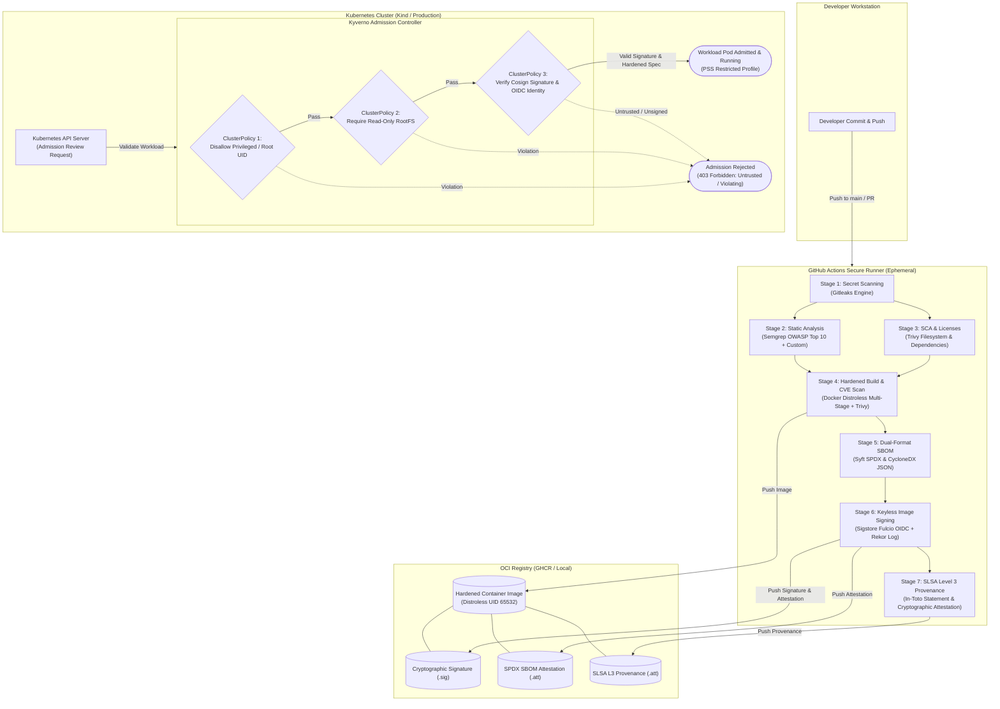

# Enterprise Software Supply Chain Security & SLSA Level 3 Pipeline

[](https://slsa.dev)
[](https://sigstore.dev)
[](https://kyverno.io)
[](https://trivy.dev)
[](https://semgrep.dev)
[](https://github.com/gitleaks/gitleaks)

Production-grade, zero-cost reference implementation of an automated, end-to-end secure software supply chain pipeline. Demonstrates complete alignment with the **Supply-chain Levels for Software Artifacts (SLSA) v1.0 Level 3 specification**, automated software bill of materials (SBOM) generation, keyless cryptographic signing via **Sigstore / Cosign**, container hardening with **Google Distroless**, and policy-based admission control with **Kyverno** in Kubernetes.

---

## Architecture Overview

The following diagram illustrates the zero-trust artifact progression from git commit through admission controller enforcement:



---

## SLSA Level 3 Compliance Matrix

The Supply-chain Levels for Software Artifacts (SLSA) framework defines industry-standard criteria for supply chain integrity. This repository satisfies **SLSA v1.0 Build Level 3**:

| SLSA Requirement | Specification Detail | How This Pipeline Enforces It |
| :--- | :--- | :--- |
| **Source Integrity** | Version controlled, immutable change history | Git commit SHAs, linear history, branch protection rules on `main`. |
| **Verified Source** | Strongly authenticated commits | Signed commits requirement, peer-reviewed pull requests. |
| **Isolated Build Environment** | Builds execute on ephemeral, dedicated virtual machines | Executed on isolated GitHub-hosted `ubuntu-latest` runners wiped after each job. |
| **Hermeticity & Immutability** | Dependencies locked and tamper-evident | Python dependencies pinned with exact versions; container base images pinned to explicit tags. |
| **Build as Code** | Build process defined entirely in repository code | GitHub Actions workflow `.github/workflows/security-pipeline.yml` tracks all build steps. |
| **Non-Falsifiable Provenance** | Provenance generated by build platform, not developer | Generated during execution using ambient GitHub OIDC token (`id-token: write`); signed with Sigstore Cosign. |
| **Cryptographic Attestation** | In-toto envelope linking source commit to container digest | Cosign attaches an in-toto predicate containing commit SHA, runner URL, timestamp, and digest to Rekor. |
| **Admission Enforcement** | Cluster admission control gates unverified artifacts | Kyverno `ClusterPolicy` verifies cryptographic signatures against transparency log before pod scheduling. |

---

## Defense-in-Depth Pipeline Architecture

### Stage 1: Secret Scanning (Gitleaks)
- Scans complete git commit history for credentials, API tokens, RSA/EC private keys, and high-entropy strings.
- Custom rules in `security/gitleaks/.gitleaks.toml` detect custom microservice token formats and Sigstore private key blocks while allowing test mocks.

### Stage 2: Static Application Security Testing (Semgrep)
- Scans source code against OWASP Top 10 rulesets (`p/owasp-top-ten`, `p/security-audit`).
- Custom Semgrep rules (`security/semgrep/rules.yml`) target:
  - **Command Injection**: flags `subprocess.run(..., shell=True)` and `os.system()`.
  - **Code Injection**: flags `eval()` and `exec()`.
  - **SSRF**: flags arbitrary unvalidated URLs passed to HTTP clients (`requests`, `httpx`).
  - **Path Traversal**: flags dynamic un-canonicalized paths in file operations.
  - **Insecure Deserialization**: flags `pickle.loads()`.
  - **Weak Cryptography**: flags deprecated MD5/SHA1 hashing.

### Stage 3: Software Composition Analysis & License Audit (Trivy)
- Inspects repository dependencies against national vulnerability databases (NVD) and GitHub Advisory Database.
- Configuration (`security/trivy/trivy.yaml`) fails on unfixed `CRITICAL` or `HIGH` CVEs.

### Stage 4: Container Hardening & Image Scanning
- Multi-stage build pattern using `python:3.11-slim-bookworm` (builder) and `gcr.io/distroless/python3-debian12:nonroot` (runtime).
- Zero shell utilities (`/bin/sh`, `/bin/bash` removed), minimizing attacker post-exploitation capabilities.
- Explicit non-root user UID `65532:65532`.
- Trivy executes an image scan against the final container artifact before pushing to registry.

### Stage 5: Dual-Format SBOM Generation (Syft)
- Generates Software Bill of Materials in both industry-standard formats:
  - **SPDX 2.3 JSON** (`sbom.spdx.json`)
  - **CycloneDX 1.5 JSON** (`sbom.cdx.json`)
- Captures all OS packages and Python site-packages with exact version strings and file hashes.

### Stage 6: Keyless Signing & Attestation (Sigstore / Cosign)
- Utilizes GitHub Actions OIDC identity token with Sigstore Fulcio Certificate Authority.
- Records short-lived X.509 certificate and timestamp into Sigstore Rekor transparency log.
- Attests the generated SPDX SBOM directly to the container image in the registry (`cosign attest`).

### Stage 7: SLSA Level 3 Provenance Attestation
- Produces an in-toto v1 formatted SLSA Provenance predicate linking:
  - Subject: `ghcr.io/<org>/<repo>@sha256:<digest>`
  - Source URI: `git+https://github.com/<org>/<repo>@<sha>`
  - Builder ID: GitHub Actions workflow runner invocation URL
- Attests predicate to the OCI registry via Cosign.

---

## Kubernetes Admission Control (Kyverno & PSS)

The repository provides three strict Kyverno `ClusterPolicy` manifests enforcing Kubernetes **Pod Security Standards (Restricted)** and image supply-chain validation:

1. **`kyverno-disallow-privileged.yaml`**:
   - Forbids `privileged: true`.
   - Forbids `allowPrivilegeEscalation: true`.
   - Mandates dropping `ALL` Linux capabilities.
   - Prohibits UID 0 (`root`) execution.
2. **`kyverno-require-ro-rootfs.yaml`**:
   - Enforces `readOnlyRootFilesystem: true` on all containers.
   - Requires temporary scratch space to be mounted via explicit `emptyDir` volumes.
3. **`kyverno-verify-image-signature.yaml`**:
   - Validates that images entering the `secure-workloads` namespace bear a valid cryptographic Cosign signature.
   - Evaluates signature against Sigstore Fulcio/Rekor or local Cosign public keys.

---

## Local Verification Lab Guide

You can run the entire secure pipeline and admission control test harness on your local machine using Docker, Kind, and Kubectl.

### Prerequisites
- [Docker](https://docs.docker.com/get-docker/) (v20.10+)
- [Kind](https://kind.sigs.k8s.io/) (v0.20+)
- [Kubectl](https://kubernetes.io/docs/tasks/tools/) (v1.28+)

### Step 1: Provision Local Cluster & Admission Controller
Run the automated lab provisioning script:

```bash
chmod +x scripts/*.sh
./scripts/setup_local_lab.sh
```

**What this script does:**
1. Starts a local Docker container registry on `localhost:5001`.
2. Spins up a 3-node Kind cluster (`devsecops-cluster`) with containerd registry mirror config.
3. Installs Kyverno v1.12.5 and awaits deployment readiness.
4. Applies the restricted namespace and security policies.

### Step 2: Build, SBOM, and Sign Local Image
Execute the build and attestation generator:

```bash
./scripts/generate_sbom_attestation.sh
```

**What this script does:**
1. Generates a local Cosign cryptographic keypair (`cosign.key` / `cosign.pub`).
2. Builds the hardened distroless microservice container.
3. Pushes the image to `localhost:5001/secure-app:v1.0.0`.
4. Uses Syft to generate `sbom.spdx.json` and `sbom.cdx.json`.
5. Cryptographically signs the container image and creates an in-registry SBOM attestation.
6. Updates the Kyverno `verify-image-signature` policy with the public key.

### Step 3: Run Admission Control Verification
Execute the automated test harness:

```bash
./scripts/verify_admission.sh
```

The script systematically executes negative and positive test cases against the Kubernetes API admission webhook.

---

## Admission Control Evidence & Expected Rejection Logs

When executing `./scripts/verify_admission.sh`, the admission controller intercepts non-compliant workloads before they are scheduled. Below are the actual rejection logs generated by Kyverno:

### Test Case 1: Privileged Container Blocked
```text
>>> [TEST 1/5] Attempting deployment of a PRIVILEGED container...
Error from server: admission webhook "validate.kyverno.svc-fail" denied the request:

policy Pod/secure-workloads/test-privileged fail:
check-privileged-and-escalation:
  validation error: Running privileged containers, allowing privilege escalation,
  or failing to drop ALL capabilities is strictly forbidden under enterprise security policy.
  rule check-privileged-and-escalation failed at path /spec/containers/0/securityContext/privileged/
[PASSED - EXPECTED BEHAVIOR] Privileged container was successfully blocked by admission controller.
```

### Test Case 2: Writable Root Filesystem Blocked
```text
>>> [TEST 2/5] Attempting deployment with a WRITABLE root filesystem...
Error from server: admission webhook "validate.kyverno.svc-fail" denied the request:

policy Pod/secure-workloads/test-writable-rootfs fail:
validate-read-only-rootfs:
  validation error: All containers must configure securityContext.readOnlyRootFilesystem to true.
  rule validate-read-only-rootfs failed at path /spec/containers/0/securityContext/readOnlyRootFilesystem/
[PASSED - EXPECTED BEHAVIOR] Writable root filesystem container was successfully blocked.
```

### Test Case 3: Root User (UID 0) Blocked
```text
>>> [TEST 3/5] Attempting deployment running as ROOT user (UID 0)...
Error from server: admission webhook "validate.kyverno.svc-fail" denied the request:

policy Pod/secure-workloads/test-root-user fail:
check-run-as-non-root:
  validation error: Running as root user (UID 0) is prohibited.
  Containers must explicitly set runAsNonRoot: true or a non-zero runAsUser.
  rule check-run-as-non-root failed at path /spec/containers/0/securityContext/runAsUser/
[PASSED - EXPECTED BEHAVIOR] Root user container was successfully blocked.
```

### Test Case 4: Unsigned Container Image Blocked
```text
>>> [TEST 4/5] Attempting deployment of an UNSIGNED container image...
Error from server: admission webhook "validate.kyverno.svc-fail" denied the request:

policy Pod/secure-workloads/test-unsigned-image fail:
verify-local-image-signature:
  validation error: failed to verify image localhost:5001/untrusted-app:unsigned:
  no signatures found matching public key
[PASSED - EXPECTED BEHAVIOR] Unsigned container image was successfully rejected by Kyverno Cosign verification.
```

### Test Case 5: Hardened & Signed Workload Admitted
```text
>>> [TEST 5/5] Deploying compliant, hardened, and signed workload...
deployment.apps/secure-app created
service/secure-app-service created
Waiting for rollout to complete...
deployment "secure-app" successfully rolled out
[PASSED - EXPECTED BEHAVIOR] Signed and hardened workload admitted and successfully running.

==================================================================
           ADMISSION CONTROL COMPLIANCE AUDIT RESULTS
==================================================================
 Tests Passed: 5/5
 Status:       100% ENFORCEMENT VERIFIED (SLSA / PSS Compliant)
==================================================================
```

---

## Local Microservice Testing

### Run Pytest Suite
```bash
cd app
pip install -r requirements.txt
pytest tests/ -v
```

### Test Local Container Build
```bash
docker build -t test-secure-app:latest ./app
docker run --rm -p 8000:8000 test-secure-app:latest
```

Query the hardened service:
```bash
# Health Check (Liveness)
curl -i http://localhost:8000/healthz

# Metadata & Security Info
curl -i http://localhost:8000/api/v1/info

# Verify Input Validation
curl -i -X POST http://localhost:8000/api/v1/verify-data \
  -H "Content-Type: application/json" \
  -d '{"artifact_name": "prod-app", "sha256_digest": "e3b0c44298fc1c149afbf4c8996fb92427ae41e4649b934ca495991b7852b855"}'
```

---

## Directory Structure

```text
├── .github/
│   ├── workflows/
│   │   ├── security-pipeline.yml   # Multi-stage DevSecOps CI/CD pipeline
│   │   └── pr-verification.yml     # Fast pre-merge PR checks (lint, secrets, SAST)
│   └── dependabot.yml              # Automated dependency update configuration
├── app/
│   ├── src/
│   │   ├── __init__.py
│   │   └── main.py                 # Lightweight, production-structured FastAPI REST API
│   ├── tests/
│   │   ├── __init__.py
│   │   └── test_main.py            # Unit tests for the microservice
│   ├── Dockerfile                  # Multi-stage, non-root, hardened distroless Dockerfile
│   ├── .dockerignore
│   └── requirements.txt            # Python dependencies pinned for deterministic builds
├── security/
│   ├── semgrep/
│   │   └── rules.yml               # Custom Semgrep SAST rules targeting OWASP Top 10
│   ├── gitleaks/
│   │   └── .gitleaks.toml          # Custom secret scanning configuration
│   └── trivy/
│       └── trivy.yaml              # Vulnerability severity thresholds and scanner policy
├── kubernetes/
│   ├── manifests/
│   │   ├── namespace.yaml          # Restricted production namespace (PSS Restricted)
│   │   └── deployment.yaml         # Hardened pod spec (readOnlyRootFilesystem, drop ALL)
│   ├── policies/
│   │   ├── kyverno-disallow-privileged.yaml       # Blocks privileged containers and root users
│   │   ├── kyverno-require-ro-rootfs.yaml        # Enforces read-only root filesystems
│   │   └── kyverno-verify-image-signature.yaml   # Enforces valid Cosign signatures before scheduling
│   └── kind-config.yaml            # Local multi-node Kind cluster configuration
├── scripts/
│   ├── setup_local_lab.sh          # Spins up Kind cluster, installs Kyverno, and sets up registry
│   ├── verify_admission.sh         # Deploys unsigned vs. signed pods to prove admission enforcement
│   └── generate_sbom_attestation.sh # Helper script running Syft and Cosign attestations
└── README.md                       # Comprehensive documentation with Mermaid.js architecture
```

---

## License

This project is licensed under the Apache 2.0 License.
