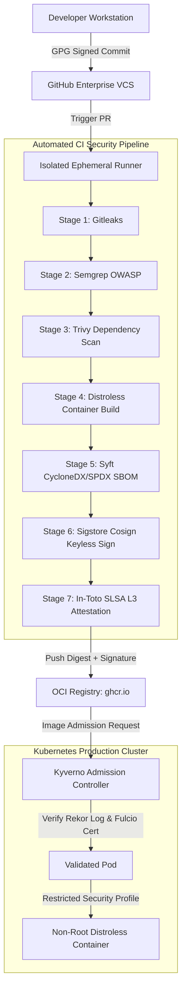
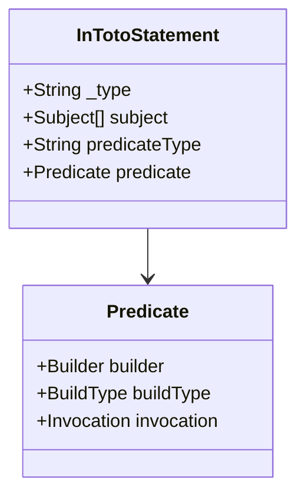

# Enterprise Supply Chain Security: Architecture Diagrams

## 1. End-to-End Build & Admission Flow

```mermaid
flowchart TD
    Dev[Developer Workstation] -->|GPG Signed Commit| GitHub[GitHub Enterprise VCS]
    GitHub -->|Trigger PR| Runner[Isolated Ephemeral Runner]
    
    subgraph CI["Automated CI Security Pipeline"]
        Runner --> SecretScan[Stage 1: Gitleaks]
        SecretScan --> SAST[Stage 2: Semgrep OWASP]
        SAST --> SCA[Stage 3: Trivy Dependency Scan]
        SCA --> Build[Stage 4: Distroless Container Build]
        Build --> SBOM[Stage 5: Syft CycloneDX/SPDX SBOM]
        SBOM --> Sign[Stage 6: Sigstore Cosign Keyless Sign]
        Sign --> Attest[Stage 7: In-Toto SLSA L3 Attestation]
    end

    Attest -->|Push Digest + Signature| Registry[OCI Registry: ghcr.io]
    Registry -->|Image Admission Request| Kyverno[Kyverno Admission Controller]
    
    subgraph K8s["Kubernetes Production Cluster"]
        Kyverno -->|Verify Rekor Log & Fulcio Cert| Validated[Validated Pod]
        Validated -->|Restricted Security Profile| Runtime[Non-Root Distroless Container]
    end
```

## 2. Cryptographic Attestation Envelope

```mermaid
classDiagram
    class InTotoStatement {
        +String _type
        +Subject[] subject
        +String predicateType
        +Predicate predicate
    }
    class Predicate {
        +Builder builder
        +BuildType buildType
        +Invocation invocation
    }
    InTotoStatement --> Predicate
```
